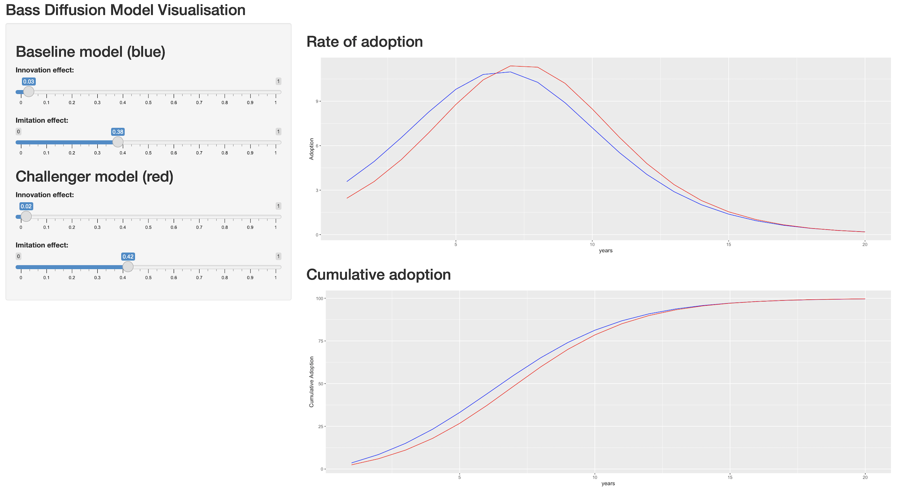

# bass_model

<!-- badges: start -->
<!-- badges: end -->

This repo provides a small shiny app to visualise the [Bass Diffusion model](https://en.wikipedia.org/wiki/Bass_diffusion_model).

Run the app in the RStudio IDE with the "Run App" button.

## Deployment

This repo contains the appropriate `manifest.json` file for a git-backed deployment to RStudio Connect.
